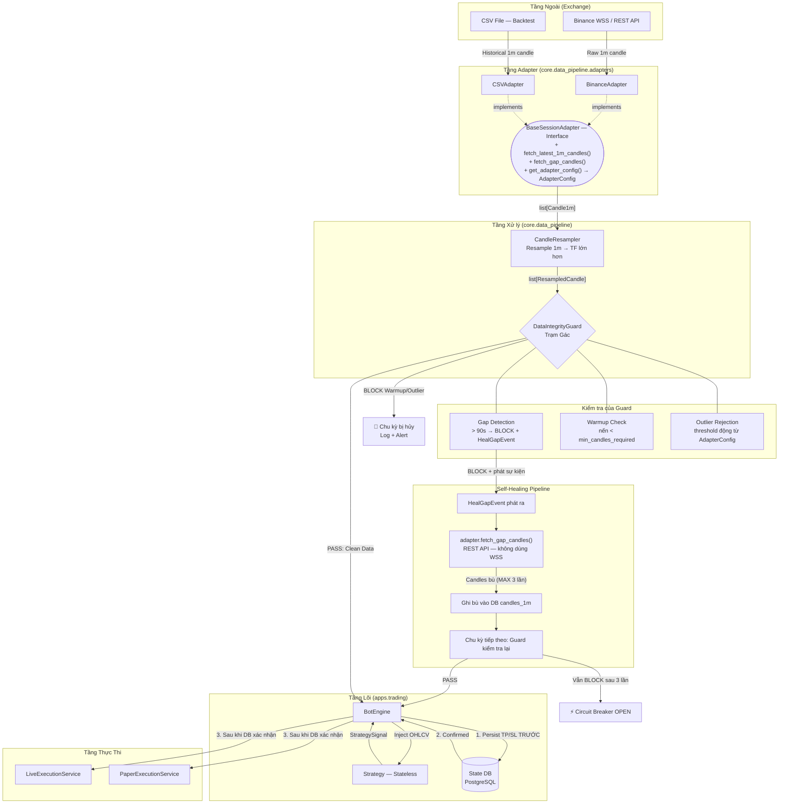

# Data Architecture Guidelines
**Version:** 1.1 (Official — Approved by Tech Lead)
**Authority:** Tech Lead — Không ai được sửa file này mà không có sự chấp thuận của Tech Lead.
**Scope:** Áp dụng cho mọi thành phần trong `src/core/data_pipeline/` và tất cả modules tương tác với dữ liệu nến (OHLCV).

---

> ## ⚠️ CẢNH BÁO BẮT BUỘC ĐỌC
> Các quy tắc trong tài liệu này là **BẤT BIẾN (IMMUTABLE)**. Vi phạm bất kỳ quy tắc nào dưới đây có thể gây ra sự sai lệch giữa Backtest và Live Trading, dẫn đến tổn thất tài chính thực tế. Không có ngoại lệ nào được phép.

---

## 1. Sơ đồ Luồng Dữ liệu Tổng thể



---

## 2. Quy tắc Bất biến #1: Chiến lược Nến Nguyên tử (Atomic 1m Strategy)

### Quy tắc

> **Hệ thống CHỈ được phép fetch và lưu nến `1m` từ Exchange vào Database. Mọi timeframe lớn hơn (5m, 15m, 1h, 4h) phải được tính toán in-memory bởi `CandleResampler`.**

### Lý do tồn tại

| Vấn đề | Hậu quả |
|---|---|
| Fetch nến 5m trực tiếp từ Exchange | Timestamp "nến đóng" lệch nhau giữa các sàn |
| Lưu nến TF lớn vào DB | Backtest thấy `high` của cả giờ nhưng không biết thứ tự SL/TP kích hoạt |
| Fetch đa timeframe cùng lúc | 5 TF × 50 symbol = 250 API calls/phút → Risk Rate Limit |

### Bảng Điều được/Cấm làm

| Điều được làm ✅ | Điều bị cấm ❌ |
|---|---|
| `await adapter.fetch_latest_1m_candles(symbol, limit=500)` | `await exchange.fetch_ohlcv(symbol, "5m")` |
| `CandleResampler.resample(candles_1m, "5m")` | Query bảng `candles_5m` từ DB |
| Lưu `Candle1m` vào bảng `candles_1m` | Tạo bảng `candles_5m`, `candles_15m`, `candles_1h` |

### Quy tắc Resample OHLCV chuẩn

```
open   = first()   # Giá mở = nến 1m đầu tiên trong nhóm
high   = max()     # Giá cao nhất trong nhóm
low    = min()     # Giá thấp nhất trong nhóm
close  = last()    # Giá đóng = nến 1m cuối cùng trong nhóm
volume = sum()     # Khối lượng = tổng cộng
```

---

## 3. Quy tắc Bất biến #2: Data Integrity Guard — Ba Cơ chế Chặn Lệnh

### Vị trí bắt buộc trong pipeline

`DataIntegrityGuard.validate()` phải được gọi **SAU** `CandleResampler.resample()` và **TRƯỚC** bất kỳ lệnh gọi Strategy nào. Không có ngoại lệ.

---

### Cơ chế #1: Gap Detection + Self-Healing Pipeline (Tự chữa lành)

**Điều kiện BLOCK:**
```
Khi: abs(candles_1m[i].timestamp - candles_1m[i-1].timestamp) > 90 giây
```

**Quy trình Self-Healing bắt buộc sau khi phát hiện Gap:**

```
Bước 1: Guard phát IntegrityCheckResult(
            status    = BLOCK_GAP,
            heal_event= HealGapEvent(symbol, gap_start, gap_end, attempt_no)
         )

Bước 2: BotEngine nhận heal_event, tăng attempt_no.
         Nếu attempt_no > MAX_HEAL_ATTEMPTS (=3) → kích hoạt Circuit Breaker, DỪNG.

Bước 3: BotEngine gọi adapter.fetch_gap_candles(symbol, since=gap_start, until=gap_end)
         → Bắt buộc dùng REST API. Không dùng WebSocket.

Bước 4: Candles bù được validate sơ bộ (không rỗng) rồi ghi vào DB (bảng candles_1m).

Bước 5: BotEngine đặt lại trạng thái chu kỳ, chờ chu kỳ phân tích kế tiếp.

Bước 6: Guard kiểm tra lại ở chu kỳ tiếp theo.
         Nếu PASS → tiếp tục bình thường.
         Nếu vẫn BLOCK_GAP → quay lại Bước 2.
```

**Log bắt buộc khi Gap BLOCK:**
```
[INTEGRITY:GAP] symbol={symbol} gap_seconds={gap} at_index={i} attempt={n}/{MAX}
```

---

### Cơ chế #2: Warmup Check (Kiểm tra Đủ Dữ liệu Khởi động)

**Điều kiện BLOCK:**
```
Khi: len(available_candles) < strategy_config.min_candles_required
```

**Bảng `min_candles_required` theo chiến lược:**

| Chiến lược | `min_candles_required` | Lý do |
|---|---|---|
| ADTS (EMA200-based) | 300 | Buffer 50% để EMA hội tụ ổn định |
| SMA Strategy | 250 | |
| Mặc định (fallback) | 200 | |

**Lưu ý:** Không gửi alert khi BLOCK do Warmup — đây là trạng thái bình thường khi bot mới khởi động và đang tích lũy dữ liệu.

**Log bắt buộc:**
```
[INTEGRITY:WARMUP] symbol={symbol} available={n} required={min_required}
```

---

### Cơ chế #3: Dynamic Outlier Rejection (Lọc Nhiễu Giá Động)

**Điều kiện BLOCK:**
```
Khi: abs(candle.close - candle.open) / candle.open > adapter_config.outlier_threshold
     HOẶC: candle.high / candle.low - 1 > adapter_config.outlier_threshold * 2
```

> ### ❌ NGHIÊM CẤM HARDCODE OUTLIER_THRESHOLD
>
> Ngưỡng lọc nhiễu **KHÔNG ĐƯỢC** là một hằng số toàn cục cố định. Mỗi loại tài sản và từng symbol có biên độ biến động (volatility) khác nhau về bản chất. Việc dùng một hằng số duy nhất sẽ Block nhầm trên thị trường biến động cao và bỏ lọc trên thị trường ổn định.
>
> **Ngưỡng phải được cung cấp động bởi `adapter.get_adapter_config().outlier_threshold`.**

**Cấu hình động theo Asset Class (giá trị mặc định đề xuất):**

| Asset Class | `outlier_threshold` mặc định | Lý do |
|---|---|---|
| `CRYPTO` | `0.10` (10%) | Crypto biến động cao hơn, ngưỡng nới hơn |
| `FOREX` | `0.03` (3%) | Forex rất ổn định, ngưỡng chặt hơn |
| `STOCKS` | `0.07` (7%) | Stocks biến động trung bình |

**Override theo từng Symbol (trong `AdapterConfig.symbol_overrides`):**
```python
# Ví dụ: SHIB và DOGE biến động cực cao, nới thêm cho chúng
symbol_overrides = {
    "SHIBUSDT": 0.20,
    "DOGEUSDT": 0.15,
}
```

**Hành động khi BLOCK Outlier:**
- Log mức `CRITICAL`: `[INTEGRITY:OUTLIER] symbol={symbol} time={ts} change={pct:.1%}`
- **Gửi alert Discord/Telegram ngay lập tức.**
- Sau 3 lần OUTLIER liên tiếp trên cùng symbol → tạm dừng Bot đó và alert admin.

---

## 4. Quy tắc Bất biến #3: Stateless Strategy Sync (Đồng bộ Trạng thái Cứng)

### Quy tắc

> **Strategy bị NGHIÊM CẤM lưu trữ bất kỳ biến số quản lý lệnh nào trên memory của class.**

### Lý do

Nếu VPS mất điện trong khi `self.current_sl = 45000.0` đang tồn tại trên RAM, khi khởi động lại Bot sẽ không biết đang có lệnh mở → **Orphan Trades** (lệnh bị bỏ rơi không ai theo dõi).

### Anti-pattern bị cấm tuyệt đối

```python
# ❌ TUYỆT ĐỐI CẤM
class MyStrategy:
    def __init__(self):
        self.current_sl    = None   # ❌
        self.trailing_stop = None   # ❌
        self.entry_price   = None   # ❌
        self.position_open = False  # ❌
```

### Pattern bắt buộc

```python
# ✅ ĐÚNG — Strategy chỉ tính toán, không lưu state
class MyStrategy:
    def on_candle_close(
        self,
        ohlcv: list[ResampledCandle],
        current_state: BotStateDTO,   # Load từ DB, inject từ BotEngine
    ) -> StrategySignal:
        """Nhận state từ ngoài vào, trả ra signal thuần túy."""
        ...
```

### Thứ tự bắt buộc khi phát sinh Signal ENTER

```
Bước 1: Strategy.on_candle_close() → StrategySignal(action=ENTER)
Bước 2: BotEngine nhận Signal, tính toán TP / SL / TrailingStop
Bước 3: BotEngine.persist_state_to_db(tp, sl, trailing)
         → GHI XUỐNG DB TRƯỚC — không làm gì khác
Bước 4: [Chờ DB xác nhận ghi thành công]
Bước 5: BotEngine → ExecutionService.place_order()
         → CHỈ GỌI SAU KHI DB ĐÃ CÓ DỮ LIỆU
```

> **Bước 3 và 4 là điều kiện tiên quyết của Bước 5.** Nếu VPS crash giữa Bước 4 và 5, khi khởi động lại hệ thống sẽ load trạng thái từ DB và tiếp tục theo dõi lệnh đúng cách.

---

## 5. Bảng Tóm tắt nhanh (Quick Reference Card)

| Quy tắc | Yêu cầu | Vi phạm điển hình |
|---|---|---|
| **Atomic 1m** | Chỉ fetch/lưu nến 1m. TF lớn → Resample | `fetch_ohlcv(symbol, "5m")` trong bot_engine |
| **Guard: Gap** | BLOCK khi timestamp gap > 90s + Self-Healing | Không gọi Guard, đưa data thẳng vào Strategy |
| **Guard: Warmup** | BLOCK khi nến < `min_candles_required` | Dùng `limit=100` nhưng EMA cần 300 nến |
| **Guard: Outlier** | BLOCK khi biến động > `adapter_config.outlier_threshold` | Hardcode `OUTLIER_THRESHOLD = 0.15` toàn cục |
| **Self-Healing** | Fetch bù dữ liệu qua REST, tối đa 3 lần | Chỉ BLOCK mà không cố gắng tự phục hồi |
| **Stateless Sync** | Persist TP/SL vào DB TRƯỚC khi place_order | `self.current_sl = ...` trong Strategy class |
