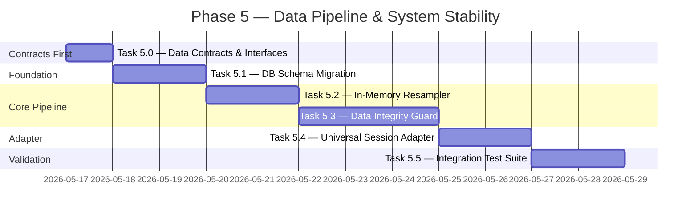

# PHASE 5 MASTER PLAN: Data Pipeline & System Stability
**Version:** 1.1 (Final Review Draft)
**Status:** AWAITING FINAL APPROVAL — Lead Architect Review
**Mục tiêu tổng thể:** Triển khai tầng dữ liệu bất biến (Immutable Data Pipeline) theo tiêu chuẩn Institutional-Grade, đảm bảo 100% nhất quán giữa môi trường Backtest và Live Trading.

---

## Nguyên tắc chỉ đạo

> **"Không có hợp đồng dữ liệu → Không có triển khai. Không có dữ liệu sạch → Không có tín hiệu. Không có tín hiệu → Không có lệnh nào được đặt."**

Mọi Task phải được **nghiệm thu độc lập** trước khi chuyển sang Task tiếp theo. Pipeline tuần tự — không có bước nào được bỏ qua.

---

## Tổng quan lộ trình



---

## Task 5.0 — Data Contracts & Interfaces (Hợp đồng Dữ liệu)

### Mục tiêu
**Bắt buộc thực hiện trước tất cả các Task khác.** Định nghĩa toàn bộ Pydantic models và Abstract Base Classes làm "hợp đồng bất biến" cho toàn bộ pipeline. Mục tiêu: Resampler, Guard, và Adapter có thể được triển khai và viết Unit Test **song song** mà không phụ thuộc implementation của nhau.

> **Lý do:** Đây là giải pháp chống rủi ro "Dependency Inversion". Nếu bỏ qua, Task 5.2 không biết `Candle1m` trông như thế nào, Task 5.3 không biết `ResampledCandle` có những trường gì — dẫn đến phải refactor toàn bộ sau khi implement.

### Files tạo mới

| File | Hành động | Nội dung |
|---|---|---|
| `src/core/data_pipeline/__init__.py` | Tạo mới | Khởi tạo package |
| `src/core/data_pipeline/schemas.py` | Tạo mới | Toàn bộ Pydantic models |
| `src/core/data_pipeline/adapters/__init__.py` | Tạo mới | Khởi tạo sub-package |
| `src/core/data_pipeline/adapters/base_adapter.py` | Tạo mới | `BaseSessionAdapter` ABC |

### Hợp đồng dữ liệu bắt buộc (`schemas.py`)

```python
# BẤT BIẾN sau khi Task 5.0 hoàn thành. Mọi thay đổi phải được Tech Lead phê duyệt.

class AssetClass(str, Enum):
    CRYPTO = "CRYPTO"
    FOREX  = "FOREX"
    STOCKS = "STOCKS"

class TradingSession(str, Enum):
    OPEN       = "OPEN"
    CLOSED     = "CLOSED"
    PRE_MARKET = "PRE_MARKET"

class IntegrityStatus(str, Enum):
    PASS            = "PASS"
    BLOCK_GAP       = "BLOCK_GAP"
    BLOCK_WARMUP    = "BLOCK_WARMUP"
    BLOCK_OUTLIER   = "BLOCK_OUTLIER"

class Candle1m(BaseModel):
    symbol:    str
    open_time: datetime
    open:      float
    high:      float
    low:       float
    close:     float
    volume:    float

class ResampledCandle(BaseModel):
    symbol:     str
    timeframe:  str       # "5m", "15m", "1h", …
    open_time:  datetime
    close_time: datetime
    open:       float
    high:       float
    low:        float
    close:      float
    volume:     float

class AdapterConfig(BaseModel):
    asset_class:       AssetClass
    outlier_threshold: float              # Ngưỡng động theo loại tài sản
    symbol_overrides:  dict[str, float] = {}  # Override theo từng symbol

class HealGapEvent(BaseModel):
    symbol:     str
    gap_start:  datetime
    gap_end:    datetime
    attempt_no: int = 1

class IntegrityCheckResult(BaseModel):
    is_valid:    bool
    status:      IntegrityStatus
    reason:      str | None       = None
    symbol:      str
    checked_at:  datetime
    heal_event:  HealGapEvent | None = None  # Chỉ có khi status=BLOCK_GAP
```

### Interface bắt buộc (`base_adapter.py`)

```python
class BaseSessionAdapter(ABC):
    """Hợp đồng interface bắt buộc cho mọi Data Adapter.

    Mọi concrete adapter (BinanceAdapter, CSVAdapter, ForexAdapter)
    đều phải implement đầy đủ 5 abstract methods này.
    """

    @abstractmethod
    async def fetch_latest_1m_candles(
        self, symbol: str, limit: int
    ) -> list[Candle1m]: ...

    @abstractmethod
    async def fetch_gap_candles(
        self, symbol: str, since: datetime, until: datetime
    ) -> list[Candle1m]:
        """Lấy bù dữ liệu trong khoảng Gap — phục vụ Self-Healing Pipeline."""
        ...

    @abstractmethod
    def get_current_session(self) -> TradingSession: ...

    @abstractmethod
    def is_tradeable_now(self) -> bool: ...

    @abstractmethod
    def get_adapter_config(self) -> AdapterConfig:
        """Trả về config động cho asset class, bao gồm outlier_threshold."""
        ...
```

### Definition of Done ✅
- [ ] `schemas.py` import thành công, tất cả models khởi tạo không lỗi.
- [ ] `BaseSessionAdapter` định nghĩa đủ 5 abstract methods.
- [ ] `from core.data_pipeline.schemas import Candle1m, ResampledCandle, IntegrityCheckResult` không lỗi.
- [ ] Toàn bộ team (và AI) xác nhận đã đọc và đồng ý với contracts trước khi bắt đầu Task 5.1.

---

## Task 5.1 — DB Schema Migration (Atomic 1m Foundation)

### Mục tiêu
Chuẩn hóa tầng lưu trữ nến: **Chỉ lưu nến 1m** làm Single Source of Truth. Xóa bỏ mọi bảng lưu nến theo timeframe lớn hơn.

### Files chịu ảnh hưởng

| File | Hành động | Ghi chú |
|---|---|---|
| `src/core/db/models/candle.py` | Sửa | Model `Candle` chỉ map tới `candles_1m` |
| `alembic/versions/xxxx_atomic_1m_schema.py` | Tạo mới | Migration script có cả `upgrade()` và `downgrade()` |
| `src/core/db/repositories/candle_repository.py` | Sửa | Xóa method `get_candles_5m/15m/1h` |
| `src/apps/trading/data_fetcher.py` | Sửa | Chỉ fetch và lưu nến `1m` |

### Definition of Done ✅
- [ ] **[Bảo vệ dữ liệu]** Backup DB xác nhận thành công trước khi chạy migration.
- [ ] `alembic upgrade head` chạy thành công, không lỗi.
- [ ] **[NÂNG CẤP AN TOÀN — BẮT BUỘC]** `alembic downgrade -1` chạy thành công và khôi phục trạng thái DB trước đó — **điều kiện bắt buộc để merge**.
- [ ] DB chỉ còn bảng `candles_1m`.
- [ ] `check_db_candles.py` chạy không lỗi.
- [ ] `grep -r "candles_5m\|candles_15m\|candles_1h" src/` trả về **kết quả rỗng**.

---

## Task 5.2 — In-Memory Resampler

### Mục tiêu
Xây dựng `CandleResampler` — module duy nhất nhận `list[Candle1m]`, trả về `list[ResampledCandle]`. Sử dụng contracts từ Task 5.0.

### Files chịu ảnh hưởng

| File | Hành động | Ghi chú |
|---|---|---|
| `src/core/data_pipeline/resampler.py` | Tạo mới | Logic Resample chính |
| `src/apps/trading/bot_engine.py` | Sửa | Thay `fetch_ohlcv(timeframe)` bằng `CandleResampler.resample()` |
| `src/dashboard/routers/backtest.py` | Sửa | Backtest dùng `CandleResampler` |
| `tests/unit/test_resampler.py` | Tạo mới | Unit test độc lập, không cần DB |

### Definition of Done ✅
- [ ] `CandleResampler.resample(candles: list[Candle1m], timeframe: str) -> list[ResampledCandle]` hoạt động đúng.
- [ ] Unit test: 5 nến 1m → 1 nến 5m với `open`=first, `high`=max, `low`=min, `close`=last, `volume`=sum.
- [ ] Backtest regression: kết quả **không thay đổi** so với trước refactor.
- [ ] `grep -r "fetch_ohlcv.*[\"']5m\|fetch_ohlcv.*[\"']15m\|fetch_ohlcv.*[\"']1h" src/` trả về **rỗng**.

---

## Task 5.3 — Data Integrity Guard

### Mục tiêu
Xây dựng `DataIntegrityGuard` — lớp chốt chặn giữa Resampler và Strategy. Guard có quyền BLOCK chu kỳ phân tích và **phát sự kiện Self-Healing** khi phát hiện Gap.

### Files chịu ảnh hưởng

| File | Hành động | Ghi chú |
|---|---|---|
| `src/core/data_pipeline/integrity_guard.py` | Tạo mới | Logic 3 cơ chế: Gap/Warmup/Outlier |
| `src/core/data_pipeline/schemas.py` | Đã có | `HealGapEvent` và `IntegrityCheckResult.heal_event` từ Task 5.0 |
| `src/apps/trading/bot_engine.py` | Sửa | Xử lý `IntegrityCheckResult` — bao gồm trigger Self-Healing |
| `src/core/logging/audit_log.py` | Tạo/Sửa | Log chi tiết mỗi lần BLOCK |
| `tests/unit/test_integrity_guard.py` | Tạo mới | 4 kịch bản: Pass/Gap/Warmup/Outlier |

### Definition of Done ✅
- [ ] `DataIntegrityGuard.validate()` hoạt động đúng signature từ Task 5.0.
- [ ] Unit test đủ 4 kịch bản: Pass / Fail-Gap / Fail-Warmup / Fail-Outlier.
- [ ] Gap BLOCK trả về `IntegrityCheckResult` với `heal_event` được populate đầy đủ.
- [ ] BotEngine xử lý `heal_event` → gọi `adapter.fetch_gap_candles()` → ghi bù vào DB.
- [ ] Log audit: timestamp, symbol, lý do BLOCK cụ thể mỗi lần chặn.
- [ ] Không có code path nào bypass Guard mà vẫn gọi được Strategy.

---

## Task 5.4 — Universal Session Adapter

### Mục tiêu
Implement `BinanceAdapter(BaseSessionAdapter)`. Refactor `data_fetcher.py` sang Adapter mới. BotEngine nhận Adapter qua Dependency Injection.

### Files chịu ảnh hưởng

| File | Hành động | Ghi chú |
|---|---|---|
| `src/core/data_pipeline/adapters/binance_adapter.py` | Tạo mới | Implement `BaseSessionAdapter` cho Binance |
| `src/apps/trading/data_fetcher.py` | Deprecated | Thin wrapper, xóa ở Phase 6 |
| `src/apps/trading/bot_engine.py` | Sửa | Inject `adapter: BaseSessionAdapter` qua `__init__` |
| `tests/mocks/mock_adapter.py` | Tạo mới | Mock dùng cho Integration Test |

### Definition of Done ✅
- [ ] `BinanceAdapter` implement đủ 5 abstract methods.
- [ ] `get_adapter_config()` trả về `AdapterConfig(asset_class=CRYPTO, outlier_threshold=0.10)`.
- [ ] `fetch_gap_candles()` gọi Binance REST API để lấy dữ liệu lịch sử (không phải WSS).
- [ ] `bot_engine.py` không còn import trực tiếp từ `data_fetcher.py`.
- [ ] `is_tradeable_now()` trả về `False` khi Circuit Breaker ở trạng thái `OPEN`.
- [ ] Comment trong `base_adapter.py` mô tả rõ cách thêm `ForexAdapter` trong tương lai.

---

## Task 5.5 — Integration Test Suite

### Mục tiêu
End-to-end test toàn pipeline: MockAdapter → Resampler → Guard → MockStrategy, bao gồm luồng Self-Healing.

### Files chịu ảnh hưởng

| File | Hành động | Ghi chú |
|---|---|---|
| `tests/integration/test_data_pipeline.py` | Tạo mới | Test suite chính |
| `tests/fixtures/candle_fixtures.py` | Tạo mới | Dữ liệu giả: normal, gap, outlier, insufficient |
| `tests/mocks/mock_adapter.py` | Từ Task 5.4 | Mock với `fetch_gap_candles()` có thể điều khiển |

### Các kịch bản test bắt buộc

| Test Case | Input | Expected Output |
|---|---|---|
| `test_happy_path` | 300 nến 1m liên tục | Guard PASS, Strategy nhận đủ data |
| `test_gap_detection_triggers_heal` | Nến #100 nhảy +5 phút | Guard BLOCK + `HealGapEvent` được phát |
| `test_self_healing_fills_gap` | Gap → Mock trả candles bù | Chu kỳ tiếp theo Guard PASS |
| `test_self_healing_max_attempts` | 3 lần heal đều thất bại | Circuit Breaker kích hoạt |
| `test_warmup_insufficient` | 50 nến (cần 300) | Guard BLOCK `INSUFFICIENT_WARMUP` |
| `test_outlier_dynamic_threshold` | Biến động 12% trên CRYPTO (threshold=10%) | Guard BLOCK `PRICE_OUTLIER_DETECTED` |
| `test_resample_accuracy` | 60 nến 1m | 12 nến 5m chính xác |
| `test_stateless_recovery` | Simulate VPS restart | Bot khôi phục TP/SL từ DB |

### Definition of Done ✅
- [ ] `pytest tests/integration/` — tất cả 8 test case PASS.
- [ ] **Coverage ≥ 80%** trên `src/core/data_pipeline/`.
- [ ] Không có test nào gọi Binance API thật (100% mock).
- [ ] `test_self_healing_max_attempts` xác nhận Circuit Breaker kích hoạt sau 3 lần thất bại.

---

## Ma trận Phụ thuộc

```
Task 5.0 (Contracts) ← GATEWAY — tất cả tasks sau phụ thuộc vào đây
    ├─► Task 5.1 (DB Migration)
    │       └─► Task 5.2 (Resampler)
    │               └─► Task 5.3 (Guard + Self-Healing)
    │                       └─► Task 5.4 (Adapter)
    │                               └─► Task 5.5 (Integration Test)
    └─► [Unit Tests 5.2, 5.3, 5.4 có thể viết SONG SONG sau khi 5.0 xong]
```

> **Quy tắc bất biến:** Không bắt đầu Task N+1 khi Task N chưa qua DoD.

---

## Rủi ro và Biện pháp

| Rủi ro | Xác suất | Tác động | Biện pháp |
|---|---|---|---|
| Migration DB làm mất dữ liệu nến cũ | Cao | Cao | Backup bắt buộc. Script `DOWN` phải pass trước khi merge. |
| Resample logic sai → Backtest lệch | Trung bình | Rất cao | Unit test fixture cố định + regression test. |
| Self-Healing loop vô hạn | Trung bình | Cao | `MAX_HEAL_ATTEMPTS = 3`, sau đó trigger Circuit Breaker. |
| Guard quá nhạy → Block nhầm | Trung bình | Trung bình | Threshold động per-asset, configurable. Log đầy đủ. |
| Schema thay đổi sau Task 5.0 | Thấp | Rất cao | Mọi thay đổi `schemas.py` phải được Tech Lead phê duyệt. |
