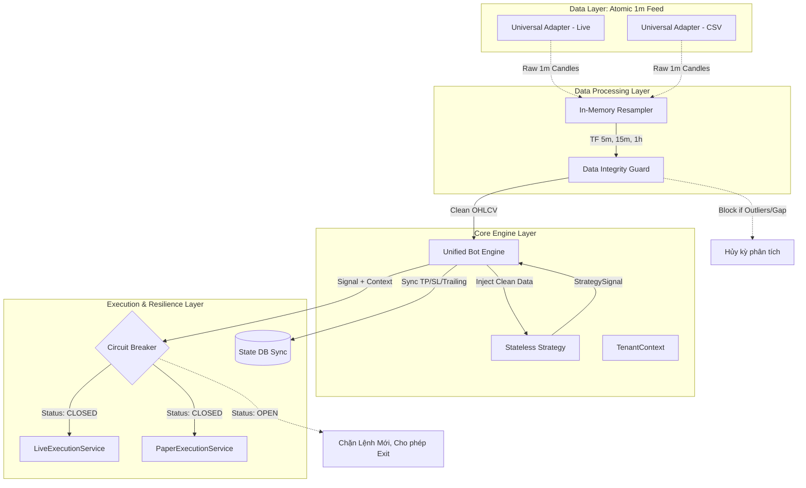

# Architecture Proposal: Intermediate Trading System (Kiến trúc Bước đệm)
**Version:** 2.0 (Elevated Correctness & Stability)
**Target:** R&D, Strategy Validation, Cost Optimization

## 1. Executive Summary (Tổng quan)
Kiến trúc Bước đệm (Intermediate Architecture) được thiết kế cho giai đoạn tối ưu chiến lược (Strategy R&D). 
Phiên bản 2.0 tập trung tuyệt đối vào **Tính đúng đắn của Dữ liệu (Data Correctness)** và **Sự ổn định của Hệ thống (Stability)**, đảm bảo môi trường Backtest và Live Trading hoạt động trên cùng một luồng dữ liệu nguyên tử được bảo vệ nghiêm ngặt. Hệ thống được đóng gói gọn nhẹ (Modular Monolith) để tiết kiệm chi phí (1 VPS).

## 2. Core Architecture & Luồng Xử Lý Sự Kiện

Sơ đồ thể hiện sự xuất hiện của các Trạm Gác (Guards) và Cầu Dao (Breakers) nhằm ngăn chặn mọi sai sót trước khi lệnh được đặt.

---

## 3. Chi tiết Cập nhật Tiêu chuẩn Kỹ thuật

### 3.1. Dữ liệu Nguyên tử (Atomic 1m) & Resampler
Thay vì Bot lấy nến theo Timeframe cấu hình (gây ra sự sai lệch giữa các sàn), Hệ thống chỉ fetch nến `1m`.
- **Cơ chế:** Dữ liệu `1m` được đẩy vào `In-Memory Resampler`. Resampler dùng Pandas để gộp nến (ví dụ: gộp 5 nến 1m thành 1 nến 5m).
- **Lợi ích:** Backtest chính xác đến từng phút bên trong cây nến lớn, giúp mô phỏng chuẩn xác việc chạm SL/TP trước hay chạm Close trước. Tránh ảo tưởng về lợi nhuận trong Backtest.

### 3.2. Data Integrity Guard (Trạm Gác Dữ Liệu)
Lớp `DataIntegrityGuard` chèn giữa Data Feeder và Bot Engine.
- **Warmup Check:** Chiến lược cần EMA200 nhưng mảng truyền vào chỉ có 199 nến -> Block.
- **Gap Detection:** Nếu phát hiện timestamp giữa 2 nến 1m liên tiếp nhảy vọt lớn hơn 1 phút (ví dụ sàn maintain) -> Block, đánh dấu dữ liệu không đáng tin cậy.
- **Outlier Rejection:** Quét bóng nến, nếu giá có biến động đột biến > 20% trong 1 phút không rõ nguyên do (Fat finger/Lỗi API) -> Block để bảo vệ Bot khỏi bị thanh lý oan.

### 3.3. Universal Adapter (Giao diện Đa Thị Trường)
Lớp lấy dữ liệu (`LiveFeed`) được triển khai qua một `Universal Adapter` chứa logic về **Trading Sessions** (Phiên giao dịch).
- Phân biệt giờ chứng khoán Mỹ (Pre-market, Core Trading, After-hours).
- Đối với Forex, lọc bỏ dữ liệu giá vào ngày cuối tuần hoặc thanh khoản mỏng.
- Adapter trả về cờ (flag) báo hiệu Session hiện tại cho BotEngine.

### 3.4. Stateless Strategy Sync (Phục hồi tức thời)
- Strategy bị cấm lưu trữ biến số quản lý lệnh trên memory của class (`self.current_sl = ...`).
- Mọi mức TP, SL, Trailing Stop được tính toán ra sẽ tạo thành bản ghi ghi xuống Database (`StateDB`) **trước khi** gửi tín hiệu đặt lệnh.
- Nếu VPS mất điện, khi bật lại, Bot load trạng thái từ DB và tiếp tục theo dõi lệnh, không xảy ra tình trạng mất dấu lệnh (Orphan Trades).

### 3.5. Circuit Breaker & Safe Mode
Nằm ở lớp `OrderManager / ExecutionService`.
- **Giám sát (Monitor):** Chạy thread phụ đo Latency API của Binance.
- **Kích hoạt (Trip):** Nếu ping > 1000ms, hoặc dính lỗi Rate Limit 429, hoặc 500 Internal Error 3 lần liên tiếp, Breaker chuyển sang trạng thái `OPEN` (Safe Mode).
- **Hành động Safe Mode:** Tự động **từ chối mọi lệnh Mở mới (Entry)** của Strategy. Chỉ cho phép các lệnh Đóng vị thế (Exit/SL) đi qua nếu kết nối khôi phục một phần. Gửi alert lên Telegram/Discord ngay lập tức.
