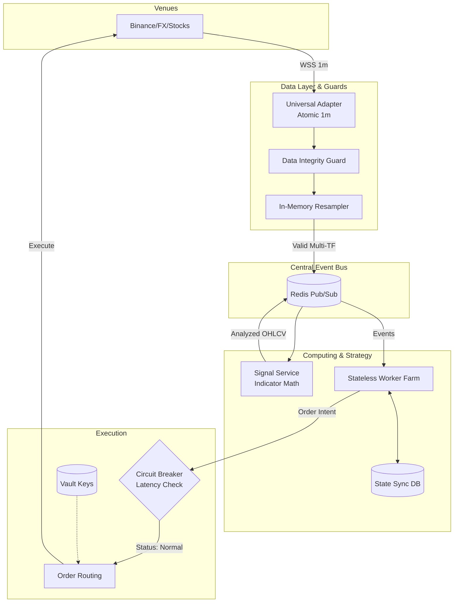

# Architecture Proposal: Multi-Tenant & Multi-Asset Trading System
**Version:** 3.0 (Bản Tiêu chuẩn Tổ chức - Institutional-Grade Edition)
**Target Audience:** Organization Leadership, Architect Lead, Engineering Team

## 1. Executive Summary (Tổng quan)
Định hướng nền tảng (Platform) đang dịch chuyển từ công cụ cá nhân sang mô hình **SaaS Multi-tenant**, hỗ trợ số lượng lớn người dùng, giao dịch trên nền tảng Crypto, **Forex và Chứng khoán**.

Tài liệu này đề xuất kiến trúc hệ thống **Event-Driven Architecture (EDA)**, giải quyết các nút thắt cổ chai về Rate Limit. Đặc biệt trong phiên bản này, nền tảng tích hợp 5 tiêu chuẩn cốt lõi nhằm nâng cấp tối đa **Tính Đúng đắn (Correctness)** và **Sự Ổn định (Stability)** để đáp ứng quy mô dòng tiền lớn.

---

## 2. Phân tích Nút thắt (Bottlenecks) & Rủi ro Kiến trúc Cũ

1. **Rủi ro API Rate Limits:** 1,000 bot chạy polling sẽ làm sập kết nối sàn.
2. **CPU Exhaustion:** Việc tính toán Indicator rải rác trên từng Bot gây hao phí CPU cấp số nhân.
3. **Data Inconsistency (Lệch dữ liệu):** Bot fetch trực tiếp nến 15m, 1h từ sàn dễ dẫn đến sự sai lệch giá so với nến thật bên trong (Tick data). Dẫn đến việc chạm Stoploss trong thực tế nhưng Backtest không thấy.
4. **Trạng thái Mỏng manh (Fragile State):** Khi tiến trình sập, các trạng thái nhạy cảm (SL/TP dời) nằm trên RAM bị bốc hơi, để lại vị thế trơ trọi (Orphan positions).
5. **Thiếu Cầu Dao Tự Động (No Circuit Breaker):** Sàn bảo trì hoặc giật lag, Bot vẫn điên cuồng nạp lệnh dẫn đến thanh lý.

---

## 3. Các Tiêu chuẩn Vàng Kỹ thuật (The 5 Golden Pillars)

Để xử lý các rủi ro trên, toàn bộ hệ thống phải được refactor xung quanh 5 trụ cột:

1. **Atomic 1m Data (Dữ liệu Nguyên Tử):**
   - Lấy nến 1 phút (hoặc Tick) làm **Single Source of Truth**. Hệ thống trung tâm sẽ Resample in-memory ra mọi timeframe khác. Đảm bảo 10,000 bot đều chạy trên cùng 1 tick dữ liệu giống hệt nhau, Backtest và Live khớp 100%.
2. **Data Integrity Guard:**
   - Middleware kiểm định gắt gao: Block action nếu thiếu nến, có gap dữ liệu, hoặc giá outlier. Rác không được phép đi vào não chiến lược (Garbage in, Blocked out).
3. **Stateless Strategy Sync:**
   - Các biến trạng thái quản lý lệnh phải được đồng bộ (Persist) xuống Database/Redis cực nhanh. Đảm bảo khả năng phục hồi sau thảm họa (Crash Resilience).
4. **Safe Mode & Circuit Breaker:**
   - Cầu dao tự động đo Latency mạng. Lập tức ngưng giao dịch (Halt Entry) nếu kết nối sàn bị trễ, bảo toàn vốn thay vì cố chấp vào lệnh rủi ro.
5. **Universal Session Adapter:**
   - Giao diện adapter đa năng nhận biết giờ mở/đóng cửa của Forex, NYSE. Chủ động cách ly bot khỏi những phiên thiếu thanh khoản.

---

## 4. Kiến trúc Đề xuất (Target Architecture Diagram)

Sự luân chuyển dữ liệu từ Sàn -> Trạm kiểm định -> Xử lý Event -> Khớp lệnh An toàn.

---

## 5. Lộ trình Triển khai Cải tiến

| Phase | Mục tiêu | Hành động cốt lõi |
|-------|----------|-------------------|
| **Phase 1: Standardization** | Áp dụng 5 Tiêu chuẩn vào kiến trúc hiện tại | 1. Ép Data Feeder chỉ fetch nến 1m, viết Resampler. 2. Thêm class DataIntegrityGuard. 3. Refactor logic BotEngine sang Stateless Sync. |
| **Phase 2: Decoupling** | Giải quyết Rate Limit | 1. Cài đặt Redis PubSub. 2. Tách Market Data Service riêng biệt, chuyên bơm nến sạch lên Redis. 3. Cài Global Circuit Breaker. |
| **Phase 3: Multi-Asset & Scale** | Phục vụ số đông user & Đa nền tảng | 1. Bật Universal Adapter tích hợp Oanda (FX), Alpaca (Stocks) với Session awareness. 2. Đưa API Key vào HashiCorp Vault. Triển khai Workers phân tán. |

## 6. Tổng kết (Conclusion)
Bằng việc đưa **Tính Đúng đắn** và **Sự Ổn định** lên làm triết lý thiết kế (Atomic 1m, Integrity Guard, Stateless Sync), kiến trúc Multi-tenant này không chỉ giải quyết bài toán scale về mặt số lượng (Rate limit, CPU), mà còn nâng cao chất lượng thực thi lệnh lên cấp độ tổ chức tài chính (Institutional-Grade), bảo vệ tài sản người dùng tối đa trước biến động nhiễu của sàn.
